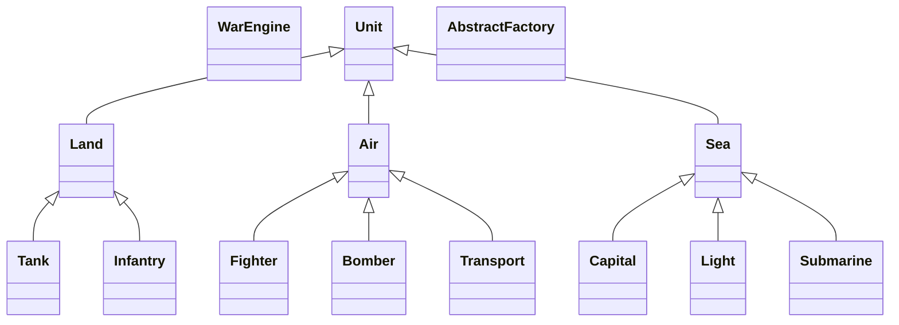

 <!-- COS 214 Project 29/09/22 -->
# COS 214 Project - 29/09/22

# General
Here some notes I've written down from the discussion we had last night and
then from talking to Francois and Jake today as well. Please ask if any anything
is unclear. Also please give feedback on anything you might not like or areas
you have suggestions for improvements we can make.

I see someone did ask on the Whatsapp what exactly we need to submit for the
pre-initial design. I though about maybe just writing up a small report on how
we are going to implement the war scenario. We can also maybe include a small
class and activity diagram to visualize the scenario.

# War Engine
Below is a basic war engine that Francois and Jake discussed in order to model a war.
```c++
while (war in progress) {
	// Update values for theatres in the war
	country1.makeDecisions();
	country2.makeDecisions();

	battle();

	// After each turn give user a summary of battles which occurred
	displayResults();
	turn++;
}

makeDecisions() {
	// Income Phase
	displayIncomeAndResources();

	// Production Phase
	buyUnits();

	// Battle Phase
	for (each theatre) {
		pickStrategy();
	}
}

battle() {
	// Compare strategies for theatres and apply modifiers
	// Kill troops, take over regions, and update state of war
}
```

# Components of War

### 5.2.1 - Theatres
Regions/areas where the war between countries or a group of countries will take
place. Thinking of making it binary to simplify implementation. Either a country
or group of countries have control of a region or they don't. If a country or
group of countries have captured all the regions then the war ends.

### 5.2.2 - Transportation
Countries will be able to transport units, troops, services from their base/home
country to specific regions in which warfare has to take place in. Transport can
also occur between regions. Transport can be sabotaged or attacked while in
progress. This can be modelled by reducing the initial amount of units, troops
or services by a specific percentage.

### 5.2.3 - Entities
We can have different types of units for land, sea, and air. That is, light,
medium and heavy. These units can be sent to various regions or battle fields to
partake in the war. The specification also mention that entities can have
different states. For example, in transport, stationed, fighting, and dead. Jake
and I also briefly came up with and idea of countries having and army of
battalions and each battle is made up of units and troops.

Specification also mentions medics, refugees, citizens and there different
states like unlisted, fighting, or returned, etc. It has not really been
discussed how this can be modelled.

### 5.2.4 - Phases of War
Francois suggested different phases in each turn of the far. Income, production
and battle phase. Income phase handles the income and resources after a turn has
taken place and before the next turn starts. Production phase handles the
acquisition of units and troops to send to various regions or battle fields.
Lastly, Battle phase handles the actual battles taking place between countries
in a region. The Battle phase has multiple strategies which a country can pick
from. For example, plan, attack, and counter.

### 5.2.5 - Changes to War Engine
Believe this has not really been discussed.

# 5.3 - War Simulations
Believe this has not really been discussed. 

# GUI/TUI
Jake and I discussed a bit the implementation of some sort of user interface. We
obviously want to keep it as simple as possible in order to not overcomplicate
things. But it feels as if basic console input/out will be to basic to implement
and showcase the various components which will be taking place throughout a war.


# Potential Patterns
- `Template Method` - Units can have template methods attack/defend. Each unit
  implements their own primitive operations for attack/defend. (5.2.3)

- `Abstract Factory` - Creation of of the different battle units. Three
  categories. Light, medium, heavy. Will correspond to each of the three
  different units of each type. e.g. Land unit factory method for the Heavy
  factory will generate a Tank. (5.2.3)

- `Factory` - Creation of different theatres regions. (5.2.1)

- `Prototype` -  Make clones of entities, regions, etc.

- `Strategy` - Each country can make use of a list of different strategies to use
  in battle. These are strategies like, Plan, Attack, Counter. (5.2.4)

- `State` - Can be used to model the different battle phases. Can also be used to model the states of the units and troops. (5.2.3)(5.2.4)

- `Composite` - Model the armies and battalions of each country. For example,
  Armies and battalions are composites where troops and units are leafs. (5.2.3)

- `Memento` - Store snapshots for the the war simulations. (5.3)

- `Observer` - Can probably be used somewhere else. However, first thing that came to mind was to use it with the GUI. The user interface has to notify the war engine that changes was made by the user.

There might be some patterns I did not think about. We are also going to be doing some more patterns in the upcoming weeks which we can also maybe make use of.



